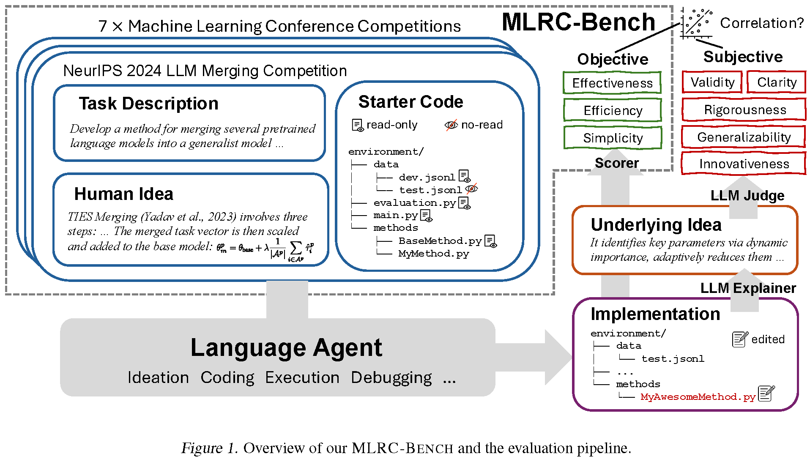
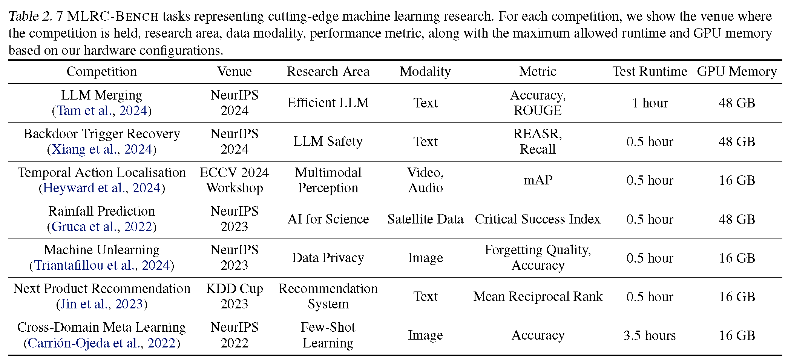

# MLRC-Bench: Can Language Agents Solve Machine Learning Research Challenges?

# News
- [2025.9] MLRC-Bench is accepted to NeurIPS 2025 Datasets and Benchmarks Track.

MLRC-Bench ([arxiv](https://arxiv.org/abs/2504.09702), [leaderboard](https://huggingface.co/spaces/launch/MLRC_Bench)) is a benchmark designed to quantify how effectively language agents can tackle challenging Machine Learning (ML) Research Competition problems by proposing and implementing novel ideas into code. 



The first release of our benchmark includes 7 tasks adapted from recent Machine Learning conference competitions.



# Setup

First, install [MLAB](https://github.com/snap-stanford/MLAgentBench) agent environment.

Create a conda enviroment named `mlab`.

Then install the MLAgentBench package with
```
pip install -e .
pip install openai
```

Install dependencies with python 3.10 by running 
```
bash install.sh
```

Then, install each task's environment by running the following commands:
```
cd MLAgentBench/benchmarks_base/${TASK_NAME}/scripts
conda env create -f environment.yml --name ${TASK_NAME}
conda activate ${TASK_NAME}
cd -
pip install -e .
pip install openai
```

(Optional) Some competition requires the following action: for Kaggle datasets, you need to set up Kaggle API and authentication (~/.kaggle/kaggle.json) as described [here](https://www.kaggle.com/docs/api). You may also need to provide manual consent to the rules of specific competitions by following the prompts. 

# Tasks

Each task is a folder in `MLAgentBench/benchmarks_base/`, under which the `env/` folder contains files that the research agent will see at the beginning, and `script/` folder contains additional hidden files such as `prepare.py` for downloading data.

To launch MLAB agent, run `bash launch.sh ${TASK_NAME} ${MODEL} ${GPU_ID}` where supported MODEL can be checked out [here](https://github.com/yunx-z/MLRC-Bench/blob/main/MLAgentBench/LLM.py#L13). You will need to specify `MY_OPENAI_API_KEY` and `MY_AZURE_OPENAI_ENDPOINT` as environment variables to use openai models.

# Instructions for Adding New Tasks (PRs Welcomed!):

Steps:
- Fork this github repo to your own github space.
- Complete steps in Setup Section for the MLAgentBench packages.
- Create a new task folder under `MLAgentBench/benchmarks_base`, following the [template](https://github.com/yunx-z/MLAgentBench/tree/main/MLAgentBench/benchmarks_base/base-competition).
- add runtime and performance of your baseline method in `MLAgentBench/constants.py` (Repeat your run multiple times to ensure consistency; the score should remain relatively stable across runs.)
- Submit a pull request.

Here are the commands to test your newly added tasks:
```
# prepare conda environment and data
cd MLAgentBench/benchmarks_base/${TASK_NAME}/scripts/
conda env create -f environment.yml
conda activate ${TASK_NAME}
# We will install MLAgentBench and openai packages in the newly created conda environment
python prepare.py

# evaluate baseline method on validation set
cd ../env
python main.py -m my_method -p dev

# evaluate baseline method on test set
cp -r ../scripts/test_data/* data/ # prepare test data (updated)
cp ../scripts/test_constants.py constants.py # prepare test-time configuration
python main.py -m my_method -p test
```

Also if possible, please include a `background.txt`  file under scripts  folder with excerpt from relevant papers or technical reports written by competition participants (besides baseline paper) containing description and core code for relevant methods. See [this](https://github.com/yunx-z/MLAgentBench/blob/main/MLAgentBench/benchmarks_base/llm-merging/scripts/background.txt) for an example on llm-merging task. This info will be used to inspire LLM agents for better solutions.

The goal of refactored code is to achieve the following requirements:

Basically this command stays constant:
`python main.py -m my_method -p dev/test`
and then any code that could deal with evaluation metrics should be read_only and need to make sure read_only files don’t contain stuff that are necessary for training and that the agent could need to modify for their implementation.

Others:
- The LLM agent will be able to “see” all files under `env/` folder so make sure not to put any test-time information (including test data and model name used in test phases) there to avoid LLM agent “cheating”.
- Also put all test data under `scripts/test_data`
- Your code should not attempt to access internet. Any pretrained models, datasets should be downloaded beforehand by `prepare.py`.

# Acknowledgements
This repo is based on [MLAgentBench](https://github.com/snap-stanford/MLAgentBench), and we thank the authors for their foundational work.
